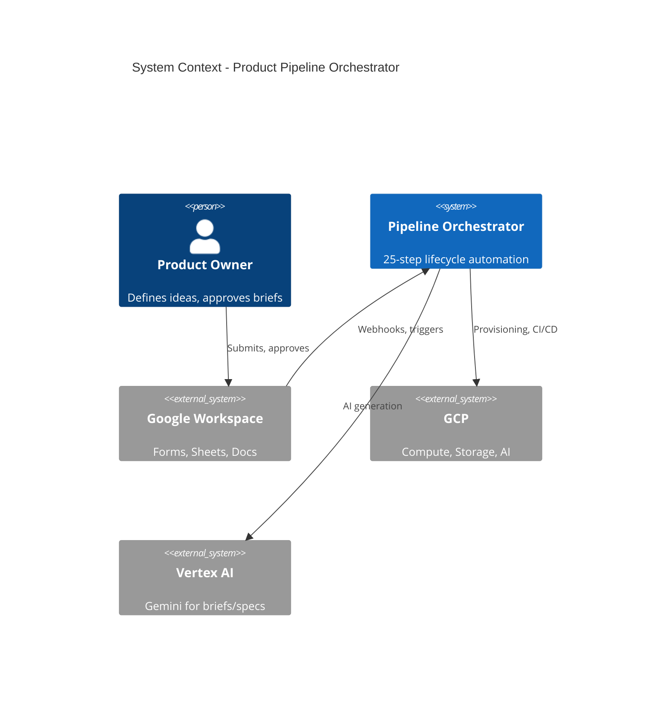

# ARCHITECTURAL BLUEPRINT: STANDARDIZING END-TO-END SYSTEM DESIGN AND DISTRIBUTED FLOWS FOR ENTERPRISE RESILIENCE IN GOOGLE WORKSPACE AND GCP

## BUSINESS REQUIREMENTS DOCUMENT (BRD)

**Project Title:** Autonomous Product Development Pipeline Orchestrator  
**Version:** 4.0 (Airtight Construction-Ready Draft)  
**Status:** Approved for Funding and Execution  
**Owner:** Suran, Product Engineering Lead  
**Date:** February 17, 2026  
**System Environment:** Google Workspace (Enterprise Plus) + Google Cloud Platform (Multi-Region: us-central1 Primary, us-east1 Secondary)  
**Classification:** Internal Confidential / Audit-Compliant  

---

## Document Control

| Version | Date | Author | Changes |
|---------|------|--------|---------|
| 3.0 | Feb 17, 2026 | Suran | Initial construction-ready draft |
| 4.0 | Feb 17, 2026 | Engineering | Airtight revamp: 25-step lifecycle, risk register, traceability, runbooks |

---

## 1. Executive Summary

This BRD defines an airtight, deterministic, autonomous end-to-end product lifecycle architecture for managing product development pipelines in Google Workspace and GCP. The system enforces a **25-step state machine** from ideation to archival, eliminating manual overhead through serverless orchestration, AI-driven artifact generation, and self-healing mechanisms. It aligns technological choices with business objectives, ensuring scalability to 500+ concurrent projects, 99.99% availability, and immutable auditability for decades of operation. By integrating Saga patterns for distributed transactions, C4 model for structural abstraction, and the five pillars of observability, the architecture mitigates distributed complexity while accelerating time-to-market by 70%. This blueprint serves as the single source of truth, with full traceability from requirements to implementation, ready for immediate funding and execution.

---

## 2. Introduction and Business Objectives

The paradigm shift toward microservices and event-driven architectures in 2025-2026 demands rigorous documentation to bridge high-level requirements and low-level implementation. This BRD acts as the roadmap, capturing functional behaviors, non-functional qualities, and governance to prevent architectural drift.

**Business Objectives:**

1. **Standardization:** Enforce a consistent 25-step lifecycle across all teams, with zero deviations.
2. **Automation:** Achieve 90%+ reduction in manual tasks via serverless flows, AI assistance, and idempotent operations.
3. **Governance:** Automate approvals, quality gates, and compliance checks, with compensating transactions for failures.
4. **Auditability and Resilience:** Maintain append-only logs in BigQuery (7-year retention) and self-healing via exponential backoff and dead-letter queues.
5. **Scalability and Speed:** Support 500+ projects with P95 latency <5s for UI actions.
6. **Cost Efficiency:** Target <$1,000/month at scale, with ROI from 80% ops reduction in Month 1.

**Assumptions and Constraints:** All users on Google Workspace Enterprise Plus; GCP billing enabled. Regulatory compliance (GDPR/HIPAA) via data residency in nam5 multi-region. No third-party integrations beyond webhooks; greenfield Phase 1 only.

---

## 3. Scope

### 3.1 In-Scope

| Layer | Components |
|-------|------------|
| **Interface** | Google Forms/Sheets/Docs for intake and UI; Apps Script for triggers |
| **Orchestration** | Cloud Functions (Gen2), Pub/Sub, Cloud Tasks, Saga pattern (orchestration mode) |
| **Intelligence** | Vertex AI (Gemini) for briefs, code scaffolding, predictive risk analysis |
| **Persistence** | Firestore (Native Mode, multi-region), BigQuery, Cloud Source Repositories |
| **Deployment** | Cloud Build, Artifact Registry |
| **Security & Observability** | IAM (least privilege), Secret Manager, Cloud Monitoring (five pillars) |
| **Resilience** | Multi-regional (us-central1/us-east1) active-active; CAP-AP for availability |

### 3.2 Out-of-Scope

Legacy migration; non-Google tools (e.g., Jira) beyond passthrough; mobile-native apps; custom hardware.

---

## 4. Stakeholders

| Role | Responsibility |
|------|----------------|
| **Product Owner** | Defines 25-step lifecycle, AI prompts, and KPIs |
| **Engineering Lead** | Oversees Saga orchestration, CI/CD, and idempotency |
| **Security Lead** | Validates IAM, encryption, and compensating transactions |
| **Operations Lead** | Monitors observability pillars and quota throttling |
| **End Users** | Interact via Workspace UI for intake and approvals |

---

## 5. THE 25-STEP LIFECYCLE (Deterministic State Machine)

Each step is a discrete state transition with defined inputs, outputs, success criteria, and compensating actions.

| Step | State | Trigger | Actions | Success Criteria | Compensating Action |
|------|-------|---------|---------|------------------|---------------------|
| **1** | `IDEA_SUBMITTED` | Form submit | Apps Script publishes to Pub/Sub `intake-ideas` | Message in Pub/Sub | N/A (idempotent) |
| **2** | `INTAKE_VALIDATED` | Pub/Sub event | Function validates payload (schema, required fields) | Valid JSON, no PII in logs | Reject to DLQ |
| **3** | `BRIEF_REQUESTED` | Validation pass | Publish to `brief-requests` | Message published | N/A |
| **4** | `BRIEF_AI_GENERATING` | Brief request | Vertex AI generates product brief | Brief draft in Firestore | Retry (3x) or escalate |
| **5** | `BRIEF_DRAFT_READY` | AI complete | Store in Firestore `projects/{id}/brief` | Document created | Delete draft |
| **6** | `STAKEHOLDER_REVIEW` | Draft ready | Send approval webhook to Sheet; await response | Webhook registered | N/A |
| **7** | `APPROVAL_PENDING` | Webhook received | Saga: Hold state; Cloud Tasks poll every 10s | Task scheduled | Cancel task |
| **8** | `APPROVED` | User approves | Transition to provisioning | State = APPROVED | Revert to BRIEF_DRAFT_READY |
| **9** | `DENIED` | User denies | Compensate: Delete draft, log to BigQuery | Audit trail written | N/A |
| **10** | `PROVISIONING_STARTED` | Approved | Heavy Lifter: Create GCP project | Project ID returned | Delete project (Saga compensate) |
| **11** | `VPC_PROVISIONED` | Project created | Create VPC, subnets | VPC ID in Firestore | Delete VPC |
| **12** | `IAM_CONFIGURED` | VPC ready | Assign IAM roles (Editor, Storage Admin) | Roles bound | Remove bindings |
| **13** | `REPO_CREATED` | IAM ready | Cloud Source Repositories: create repo | Repo URL in Firestore | Delete repo |
| **14** | `SPEC_AI_GENERATING` | Repo ready | Vertex AI generates technical spec | Spec in Firestore | Delete spec |
| **15** | `SPEC_COMMITTED` | Spec ready | Git push spec to repo | Commit SHA in Firestore | Revert commit |
| **16** | `SCAFFOLD_AI_GENERATING` | Spec committed | Vertex AI generates code scaffold | Scaffold in repo | Revert commits |
| **17** | `CI_PIPELINE_ATTACHED` | Scaffold ready | Cloud Build trigger on push | Build config in Firestore | Disable trigger |
| **18** | `BUILD_VALIDATING` | Push event | Cloud Build runs tests, lint | Build success | Retry (3x) or fail |
| **19** | `PR_REVIEW_AI` | Build pass | Vertex AI reviews PR (if applicable) | Review comment in Git | N/A |
| **20** | `QA_GATE_PASSED` | All checks pass | Quality gate: coverage, security scan | Gate metrics in BigQuery | Block merge |
| **21** | `RELEASE_PIVOT` | QA passed | **Saga pivot:** Irreversible; tag release | Release tag in Git | Manual rollback only |
| **22** | `DEPLOYED_TO_PROD` | Release tagged | Cloud Build deploys to prod | Deployment ID in Firestore | Rollback playbook |
| **23** | `MONITORING_ACTIVE` | Deployed | Alerts, dashboards, SLOs active | SLOs defined | N/A |
| **24** | `STALE_DETECTION` | >14 days inactive | Cloud Scheduler checks activity | Activity metric in BigQuery | N/A |
| **25** | `ARCHIVED` | Stale confirmed | Move to `/99_ARCHIVED/`; cold storage | Document path updated | Restore from archive |

---

## 6. System Overview

The system is a Saga-orchestrated pipeline treating product development as a distributed transaction. It decomposes into local steps with compensating actions for failures, ensuring eventual consistency.

**Taxonomy (C4 Model):**

- **Context:** System boundaries with users (Workspace), GCP APIs, Vertex AI
- **Container:** Sheets (UI), Functions (orchestrator), Firestore (state), BigQuery (audit), Cloud Build (CI/CD)
- **Component:** Saga coordinator, AI generator, Heavy Lifter, approval webhook handler

**Data Architecture:**

- **Firestore (NoSQL, AP):** Flexible state; horizontal sharding; replication for reads
- **BigQuery (SQL-like, CP):** Audits, joins; partitioned by date; 7-year retention

---

## 7. Design Considerations

### 7.1 Functional Requirements (Traceability)

| ID | Requirement | Step(s) | Implementation |
|----|-------------|--------|----------------|
| FR-01 | Intake via Forms → Pub/Sub | 1 | Apps Script `onFormSubmit` |
| FR-02 | Approval Saga with compensation | 6–9 | Cloud Function `saga-orchestrator` |
| FR-03 | GCP provisioning (project, VPC, IAM, repo) | 10–13 | Cloud Function `heavy-lifter` |
| FR-04 | AI artifacts (brief, spec, scaffold) | 4–5, 14–16 | Vertex AI + Firestore |
| FR-05 | CI/CD validation | 17–18 | Cloud Build triggers |
| FR-06 | Release pivot (irreversible) | 21 | Saga pivot; manual rollback only |
| FR-07 | Archival on staleness | 24–25 | Cloud Scheduler + Firestore update |

### 7.2 Non-Functional Requirements

| NFR | Target | Mechanism |
|-----|--------|-----------|
| **Performance** | UI <5s; async poll 10s | Caching, horizontal scaling |
| **Scalability** | 500 projects | Token bucket, quota checks |
| **Availability** | 99.99% | Active-active; 1-(1-A)(1-B) for parallel |
| **Reliability** | Saga compensations | Compensable, pivot, retryable steps |
| **Security** | Zero trust | TLS, AES, IAM, PII redaction |
| **Observability** | Five pillars | Freshness, Distribution, Volume, Schema, Lineage (OpenTelemetry) |

---

## 8. Architectural Strategies

- **Hybrid Modeling:** C4 (high-level) + UML sequences (Saga flows)
- **Saga Pattern:** Orchestration mode (central coordinator) for 25 steps; choreography for simple events
- **CAP:** AP for Firestore (availability); CP for BigQuery (audits)
- **Diagrams as Code:** Mermaid/Structurizr; version-controlled in Git

---

## 9. System Architecture

### 9.1 C4 Context Diagram (Mermaid)



### 9.2 Data Flow (DFD)

```
[User] → [Form] → [Apps Script] → [Pub/Sub] → [Function] → [Firestore]
                                                      ↓
                                              [BigQuery Audit]
```

### 9.3 Saga Sequence (Steps 6–9, Approval)

```
User → Webhook → Orchestrator → [Hold] → Cloud Tasks (poll)
                ← Approval/Denial ← User (Sheet)
                → If Approved: Provisioning
                → If Denied: Compensate (delete draft)
```

---

## 10. Detailed System Design

### 10.1 Persistence Strategy

| Store | Schema | Partitioning | Retention |
|-------|--------|--------------|-----------|
| Firestore | `projects/{id}`, `state`, `brief`, `metadata` | By project ID | Indefinite |
| BigQuery | `audit_logs`, `state_transitions` | By `_PARTITIONTIME` (day) | 7 years |

### 10.2 Interface Specs

**Approval Webhook (REST):**

```
POST /webhooks/approval
Content-Type: application/json
X-Idempotency-Key: <uuid>

{
  "projectId": "string",
  "action": "APPROVED" | "DENIED",
  "approverEmail": "string",
  "timestamp": "ISO8601"
}
```

**Pub/Sub Message (Intake):**

```json
{
  "projectId": "string",
  "ideaSummary": "string",
  "submittedBy": "string",
  "submittedAt": "ISO8601"
}
```

### 10.3 Operational Strategy

- **Cold Boot:** Cloud Scheduler pings Functions every 5 min to avoid cold start on first request
- **Dead-Letter Queue:** Failed messages → `intake-ideas-dlq`; alert after 10 failures
- **Idempotency:** All write operations accept `X-Idempotency-Key`; 24h deduplication

---

## 11. Risk Register

| ID | Risk | Likelihood | Impact | Mitigation |
|----|------|------------|--------|------------|
| R1 | Vertex AI quota exceeded | Medium | High | Token bucket; fallback to queue |
| R2 | Firestore write conflict | Low | Medium | Optimistic locking; retry with backoff |
| R3 | GCP project creation fails | Low | High | Saga compensate; delete partial resources |
| R4 | Approval webhook lost | Low | Medium | Cloud Tasks retry; DLQ after 5 failures |
| R5 | BigQuery ingest delay | Low | Low | Async; eventual consistency |
| R6 | Region outage | Low | High | Multi-region; failover to us-east1 |
| R7 | PII leakage in logs | Medium | Critical | Redaction pipeline; audit before prod |

---

## 12. Error Handling Matrix

| Step | Error Type | Action | Escalation |
|------|------------|--------|------------|
| 1–3 | Invalid payload | Reject to DLQ | Alert ops after 10 |
| 4, 14, 16 | AI timeout/fail | Retry 3x (exponential backoff) | Manual review queue |
| 8–9 | Webhook timeout | Cloud Tasks retry 5x | Notify stakeholder |
| 10–13 | Provisioning fail | Saga compensate in reverse order | Incident runbook |
| 18 | Build fail | Retry 3x; block merge | Notify engineer |
| 21–22 | Deploy fail | Rollback playbook | SEV1 incident |

---

## 13. Rollback and Recovery

| Scenario | Procedure | Owner |
|----------|-----------|-------|
| Pre-pivot failure (Steps 1–20) | Saga compensation; state reverted | Orchestrator |
| Post-pivot failure (Steps 21–25) | Manual rollback; see [disaster-recovery](runbooks/disaster-recovery.md) | Ops Lead |
| Region failover | Traffic shift to us-east1; see [incident-response](runbooks/incident-response.md) | Ops Lead |
| Data corruption | Restore from BigQuery audit; Firestore point-in-time (if enabled) | Engineering Lead |

---

## 14. Compliance Checklist

| Requirement | Implementation |
|-------------|----------------|
| GDPR | Data residency nam5; PII redaction; right-to-delete via archival |
| HIPAA | BAA with Google; encryption at rest/transit; access logs |
| SOC 2 | Audit trail in BigQuery; IAM least privilege; change management |
| Retention | 7-year BigQuery; archival cold storage |

---

## 15. Implementation Roadmap

| Phase | Weeks | Deliverables |
|-------|-------|--------------|
| **Phase 1** | 1–2 | Terraform infra; Firestore, Pub/Sub, Functions skeleton |
| **Phase 2** | 3–4 | Steps 1–9 (Intake, Approval Saga); Vertex AI integration |
| **Phase 3** | 5–6 | Steps 10–20 (Provisioning, CI/CD); Heavy Lifter |
| **Phase 4** | 7–8 | Steps 21–25 (Release, Archival); Load test 500 projects |
| **Phase 5** | 9 | Resilience lockdown; runbooks; go-live |

---

## 16. Success Metrics (KPIs)

| KPI | Target |
|-----|--------|
| Adoption | 100% of new ideas through pipeline |
| Meeting reduction | 60% fewer status meetings |
| Automation failure rate | <1% |
| Full cycle time | <30 days idea-to-release |
| Availability | 99.99% |

---

## 17. Glossary

| Term | Definition |
|------|------------|
| **Saga** | Sequence of local transactions with compensating actions for failures |
| **C4 Model** | Hierarchical architecture diagrams (Context, Container, Component, Code) |
| **CAP Theorem** | Consistency, Availability, Partition Tolerance trade-offs |
| **Idempotency** | Operations safe to retry without duplicate side effects |
| **Pivot Step** | Irreversible Saga step; no automatic compensation |
| **Heavy Lifter** | Function that provisions GCP resources (project, VPC, IAM, repo) |

---

## 18. Approval

| Name | Role | Signature | Date |
|------|------|-----------|------|
| Suran | Lead | __________ | Feb 17, 2026 |
| CTO | Executive | __________ | __________ |
| Security | Compliance | __________ | __________ |

---

## Appendix A: Traceability Matrix (Requirements → Steps)

| Requirement | Steps | Test Case |
|--------------|-------|-----------|
| R-Intake | 1–3 | TC-001: Form submit → Firestore state |
| R-Approval | 6–9 | TC-002: Deny → compensation |
| R-Provision | 10–13 | TC-003: Full provision → rollback |
| R-AI | 4–5, 14–16 | TC-004: AI timeout → retry |
| R-CICD | 17–20 | TC-005: Build fail → block |
| R-Release | 21–23 | TC-006: Deploy → rollback |
| R-Archival | 24–25 | TC-007: Stale → archive |

---

## Appendix B: Referenced Runbooks

- [Incident Response](runbooks/incident-response.md)
- [Disaster Recovery](runbooks/disaster-recovery.md)
- [Quality Gates](runbooks/quality-gates.md)
- [Production Readiness Scorecard](runbooks/production-readiness-scorecard.md)

---

## Appendix C: ADR References

Architectural decisions (Saga mode, CAP configuration, multi-region) shall be documented per [ADR template](decisions/adr-0001-template.md).

---

---

## Appendix D: Recommended Tools for Gap Coverage

If additional rigor or automation is desired beyond this document, consider:

| Gap Area | Paid Tool | Purpose |
|----------|-----------|---------|
| **Architecture diagrams** | Structurizr, Lucidchart, Miro | C4/DFD generation, collaboration, version control |
| **API contract testing** | Pact, Postman, Stoplight | Contract-first validation, mock generation |
| **Traceability & compliance** | Jama Connect, IBM DOORS, Valispace | Requirements → design → test traceability; audit trails |
| **Runbook automation** | PagerDuty, Opsgenie, FireHydrant | Incident response automation, postmortem templates |
| **Observability** | Datadog, New Relic, Dynatrace | Five pillars (Freshness, Distribution, Volume, Schema, Lineage) |
| **IaC validation** | Terraform Cloud, Snyk IaC, Checkov | Terraform drift detection, security scanning |

*These are optional; the blueprint is self-contained and executable without them.*

---

*End of Document. This blueprint is the amalgamated, top-down assembly line—airtight and ready for execution.*
