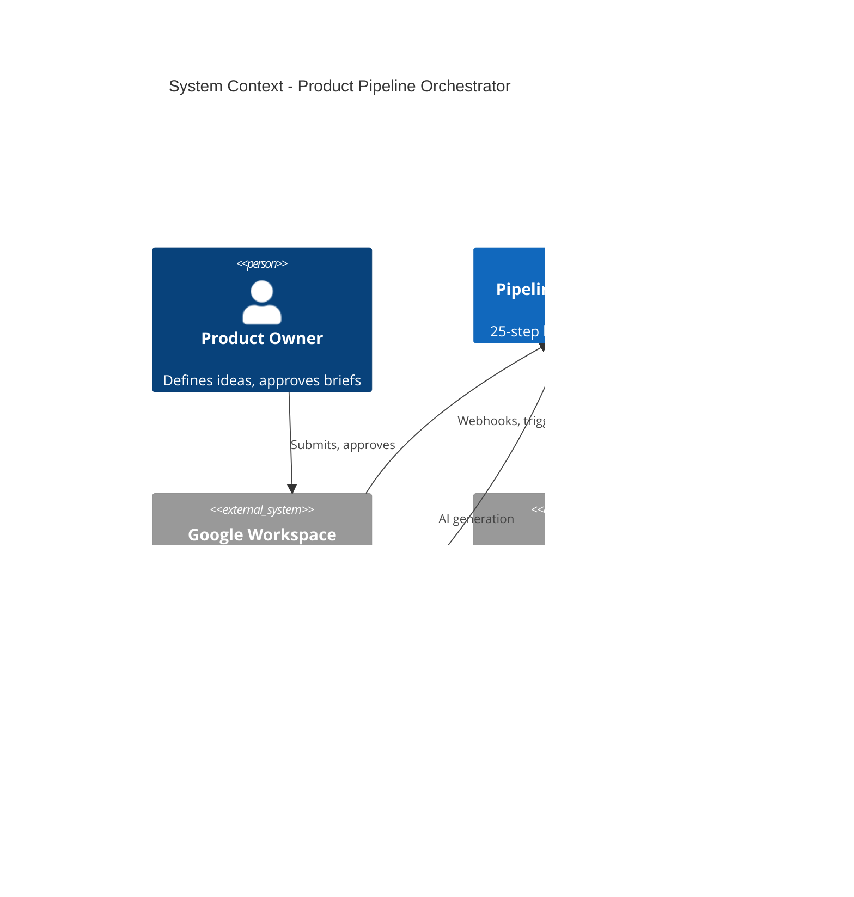

# ARCHITECTURAL BLUEPRINT: STANDARDIZING END-TO-END SYSTEM DESIGN AND DISTRIBUTED FLOWS FOR ENTERPRISE RESILIENCE IN GOOGLE WORKSPACE AND GCP

## BUSINESS REQUIREMENTS DOCUMENT (BRD)

**Project Title:** Autonomous Product Development Pipeline Orchestrator  
**Version:** 4.0 (Airtight Construction-Ready Draft)  
**Status:** Approved for Funding and Execution  
**Owner:** Suran, Product Engineering Lead  
**Date:** February 17, 2026  
**System Environment:** Google Workspace (Enterprise Plus) + Google Cloud Platform (Multi-Region: us-central1 Primary, us-east1 Secondary)  
**Classification:** Internal Confidential / Audit-Compliant  

---

## Document Control

| Version | Date | Author | Changes |
|---------|------|--------|---------|
| 3.0 | Feb 17, 2026 | Suran | Initial construction-ready draft |
| 4.0 | Feb 17, 2026 | Engineering | Airtight revamp: 25-step lifecycle, risk register, traceability, runbooks |
| 4.1 | Feb 17, 2026 | Engineering | Google-first mandate; operational automations (PR staleness, nudges); no 3rd party where Google suffices |
| 4.2 | Feb 17, 2026 | Engineering | Research phase (NotebookLM, Drive); Prototype phase; mandatory Cloud Build per repo (zero exceptions); continuous improvement; SDLC/bug tracking |

---

## 1. Executive Summary

This BRD defines an airtight, deterministic, autonomous end-to-end product lifecycle architecture for managing product development pipelines in **Google Workspace and GCP exclusively**. The system enforces a **25+ step state machine** from ideation through **research (NotebookLM, Drive), prototype, code, fullstack, features, repos, bugs, launches, and continuous improvement forever**. **Mandatory triggers:** Every repo gets Cloud Build on creation—no repo without deploy. No "forgot to wire Cloud Build." Research triggers on approval; prototype triggers on research complete; deploy on merge to main. SDLC, debugging, project management—all automated. **Google-first mandate:** Forms, Sheets, Docs, Drive, Gmail, Chat, Apps Script, Workflows, Cloud Functions, Pub/Sub, Vertex AI, NotebookLM, Firestore, BigQuery, Cloud Build, Cloud Source Repositories—at every step. Operational automations (PR staleness, build-failure alerts, approval nudges) ensure nothing dies on the vine. Third-party tools only when Google has no equivalent. Ready for immediate funding and execution.

---

## 2. Introduction and Business Objectives

The paradigm shift toward microservices and event-driven architectures in 2025-2026 demands rigorous documentation to bridge high-level requirements and low-level implementation. This BRD acts as the roadmap, capturing functional behaviors, non-functional qualities, and governance to prevent architectural drift.

**Business Objectives:**

1. **Standardization:** Enforce a consistent 25-step lifecycle across all teams, with zero deviations.
2. **Automation:** Achieve 90%+ reduction in manual tasks via serverless flows, AI assistance, and idempotent operations.
3. **Governance:** Automate approvals, quality gates, and compliance checks, with compensating transactions for failures.
4. **Auditability and Resilience:** Maintain append-only logs in BigQuery (7-year retention) and self-healing via exponential backoff and dead-letter queues.
5. **Scalability and Speed:** Support 500+ projects with P95 latency <5s for UI actions.
6. **Cost Efficiency:** Target <$1,000/month at scale, with ROI from 80% ops reduction in Month 1.

**Assumptions and Constraints:** All users on Google Workspace Enterprise Plus; GCP billing enabled. Regulatory compliance (GDPR/HIPAA) via data residency in nam5 multi-region. **Google-first mandate:** All tools, automations, and workflows use Google Workspace + GCP exclusively where feasible; third-party only when no Google equivalent exists. Greenfield Phase 1 only.

---

## 3. Scope

### 3.1 In-Scope

| Layer | Components (All Google-Native) |
|-------|------------------------------|
| **Interface** | Google Forms, Sheets, Docs, Drive, Gmail, Chat; Apps Script for triggers; Google Workflows |
| **Orchestration** | Cloud Functions (Gen2), Pub/Sub, Cloud Tasks, **Google Workflows**, Saga pattern (orchestration mode) |
| **Intelligence** | Vertex AI (Gemini); **NotebookLM** (research); Colab (prototypes) |
| **Persistence** | Firestore (Native Mode, multi-region), BigQuery, Cloud Source Repositories |
| **Deployment** | Cloud Build, Artifact Registry |
| **Security & Observability** | IAM (least privilege), Secret Manager, Cloud Monitoring, Cloud Trace, Cloud Logging (five pillars) |
| **Resilience** | Multi-regional (us-central1/us-east1) active-active; CAP-AP for availability |
| **Operational Automations** | PR staleness, approval nudges, build-failure alerts, research-folder creation, bug triage, deploy-on-merge (all via Workspace + GCP) |
| **SDLC / Project Management** | Sheets (sprints, backlog); Cloud Source Repos Issues (bugs); Cloud Build (CI/CD); no manual deploy |

### 3.2 Out-of-Scope

Legacy migration; non-Google tools (e.g., Jira, PagerDuty, Datadog) unless no Google equivalent; mobile-native apps; custom hardware.

---

## 4. Stakeholders

| Role | Responsibility |
|------|----------------|
| **Product Owner** | Defines 25-step lifecycle, AI prompts, and KPIs |
| **Engineering Lead** | Oversees Saga orchestration, CI/CD, and idempotency |
| **Security Lead** | Validates IAM, encryption, and compensating transactions |
| **Operations Lead** | Monitors observability pillars and quota throttling |
| **End Users** | Interact via Workspace UI for intake and approvals |

---

## 5. THE 25-STEP LIFECYCLE (Deterministic State Machine)

Each step is a discrete state transition with defined inputs, outputs, success criteria, and compensating actions.

| Step | State | Trigger | Actions | Success Criteria | Compensating Action |
|------|-------|---------|---------|------------------|---------------------|
| **1** | `IDEA_SUBMITTED` | Form submit | **Apps Script `onFormSubmit`** (installable—never `onOpen`) publishes to Pub/Sub `intake-ideas`; fallback: Cloud Scheduler polls Sheet every 15 min for unprocessed rows | Message in Pub/Sub | N/A (idempotent) |
| **2** | `INTAKE_VALIDATED` | Pub/Sub event | Function validates payload; **idempotency:** check Firestore for existing `projectId` before processing | Valid JSON, no PII in logs | Reject to DLQ |
| **3** | `BRIEF_REQUESTED` | Validation pass | Publish to `brief-requests` | Message published | N/A |
| **4** | `BRIEF_AI_GENERATING` | Brief request | Vertex AI generates product brief | Brief draft in Firestore | Retry (3x) or escalate |
| **5** | `BRIEF_DRAFT_READY` | AI complete | Store in Firestore `projects/{id}/brief` | Document created | Delete draft |
| **6** | `STAKEHOLDER_REVIEW` | Draft ready | Send approval webhook to Sheet; await response | Webhook registered | N/A |
| **7** | `APPROVAL_PENDING` | Webhook received | Saga: Hold state; Cloud Tasks poll every 10s | Task scheduled | Cancel task |
| **8** | `APPROVED` | User approves | Transition to provisioning | State = APPROVED | Revert to BRIEF_DRAFT_READY |
| **9** | `DENIED` | User denies | Compensate: Delete draft, log to BigQuery | Audit trail written | N/A |
| **9a** | `RESEARCH_STARTED` | Approved | **Trigger:** Create Drive folder, NotebookLM corpus, Docs template; publish to `research-started` | Drive folder URL in Firestore | Delete folder |
| **9b** | `PROTOTYPE_STARTED` | Research complete | **Trigger:** Create prototype Doc/Colab; link to brief | Prototype link in Firestore | Delete prototype |
| **10** | `PROVISIONING_STARTED` | Prototype approved | Heavy Lifter: Create GCP project | Project ID returned | Delete project (Saga compensate) |
| **11** | `VPC_PROVISIONED` | Project created | Create VPC, subnets | VPC ID in Firestore | Delete VPC |
| **12** | `IAM_CONFIGURED` | VPC ready | Assign IAM roles (Editor, Storage Admin) | Roles bound | Remove bindings |
| **13** | `REPO_CREATED` | IAM ready | **Cloud Source Repos + Cloud Build trigger created together**—no repo without deploy. Create repo; create Cloud Build trigger on push to main; create trigger on PR. Zero exceptions. | Repo URL + Build trigger IDs in Firestore | Delete repo + triggers |
| **14** | `SPEC_AI_GENERATING` | Repo ready | Vertex AI generates technical spec | Spec in Firestore | Delete spec |
| **15** | `SPEC_COMMITTED` | Spec ready | Git push spec to repo | Commit SHA in Firestore | Revert commit |
| **16** | `SCAFFOLD_AI_GENERATING` | Spec committed | Vertex AI generates code scaffold | Scaffold in repo | Revert commits |
| **17** | `CI_PIPELINE_ATTACHED` | Scaffold pushed | **Trigger already exists** (from step 13). First build runs; `cloudbuild.yaml` in repo. Validate build succeeds. | Build config + first success in Firestore | Disable trigger |
| **18** | `BUILD_VALIDATING` | Push/PR event | Cloud Build runs tests, lint (trigger fires automatically—no manual wiring) | Build success | Retry (3x) or fail |
| **19** | `PR_REVIEW_AI` | Build pass | Vertex AI reviews PR (if applicable) | Review comment in Git | N/A |
| **20** | `QA_GATE_PASSED` | All checks pass | Quality gate: coverage, security scan | Gate metrics in BigQuery | Block merge |
| **21** | `RELEASE_PIVOT` | QA passed | **Saga pivot:** Irreversible; tag release | Release tag in Git | Manual rollback only |
| **22** | `DEPLOYED_TO_PROD` | Release tagged | Cloud Build deploys to prod | Deployment ID in Firestore | Rollback playbook |
| **23** | `MONITORING_ACTIVE` | Deployed | Alerts, dashboards, SLOs active | SLOs defined | N/A |
| **24** | `STALE_DETECTION` | >14 days inactive | Cloud Scheduler checks activity | Activity metric in BigQuery | N/A |
| **25** | `ARCHIVED` | Stale confirmed | Move to `/99_ARCHIVED/`; cold storage | Document path updated | Restore from archive |
| **∞** | `CONTINUOUS_IMPROVEMENT` | Post-launch forever | Bugs → Cloud Source Repos Issues / Sheet; feedback → Pub/Sub; deploys on merge to main. SDLC loops. | Improvement cycles logged in BigQuery | N/A |

### 5.1 Full Pipeline: Research → Prototype → Code → Launch → Forever

**Once you decide to go in, everything triggers. No games.**

| Phase | Trigger | What Happens (All Automated) |
|-------|---------|-----------------------------|
| **Research** | Approval (step 8) | **Drive folder** created; **NotebookLM** corpus from brief + uploaded docs; **Doc** template for notes; **Chat** notification with links. Absorb and learn—all data as fast and efficiently as possible. |
| **Prototype** | Research complete (manual "done" or 7-day auto) | **Colab** or **Doc** for prototype; link to brief; Vertex AI drafts wireframe/mockup text. Prototype that has a chance. |
| **Code** | Prototype approved | Repo + Cloud Build **created together**. No repo without deploy. Push → build. PR → build. No "forgot to wire Cloud Build." |
| **Features / Bugs** | PR opened, issue created | Cloud Build runs. PR staleness → Chat. Bugs → Sheet or Cloud Source Repos Issues. |
| **Launch** | QA passed | Tag → deploy. Cloud Build deploys. No manual deploy step. |
| **Forever** | Merge to main, feedback, bugs | Deploy on merge. Feedback form → Pub/Sub → improvement backlog. Bugs → **Cloud Source Repos Issues** or **Sheet** triage. **SDLC**, debugging (Cloud Logging/Trace), project management (Sheets milestones). Continuous improvement forever. |

### 5.2 Mandatory Triggers (Zero Exceptions—No Repo Left Behind)

**Every project gets these. No manual setup. No "we forgot this one."**

| Trigger | When | What | Enforced By |
|---------|------|-----|-------------|
| **Cloud Build on push to main** | Repo created (step 13) | Build + test + deploy. Created in same automation as repo. | Heavy Lifter; Terraform/Deployment Manager |
| **Cloud Build on PR** | Repo created (step 13) | Build + test; block merge if fail | Heavy Lifter |
| **Build failure → Chat** | Build fails | Post to #engineering with log link | Cloud Build webhook → Pub/Sub → Function |
| **PR >3 days → Chat + Gmail** | Daily | Stale PR list; no PR dies on the vine | Cloud Scheduler → Function |
| **Deploy on merge to main** | Merge event | Auto-deploy to prod/staging | Cloud Build trigger |
| **Research folder creation** | Approval | Drive folder + NotebookLM | Pub/Sub → Function |
| **Bug/issue creation → triage** | Issue created | Sheet row or Chat | Cloud Source Repos webhook or Form |

**Rule:** A repo that cannot deploy is a failed provision. Roll back. Fix. No exceptions.

**Research phase tools (fast, efficient):** NotebookLM (corpus from brief + Drive docs); Drive folder per project; Docs for notes; Chat notification with links. Trigger: approval. No waiting.

**SDLC / Debugging:** Cloud Source Repos Issues for bugs; Sheet for triage/backlog; Cloud Build runs on every push/PR; deploy on merge to main. No manual deploy. No "repos not deploying because we didn't use Cloud Build properly."

### 5.3 Operational Automations (Parallel to Lifecycle)

These automations run continuously alongside the 25-step flow—ensuring nothing dies on the vine from inception through global scale.

| Automation | Trigger | Google Tools | Action |
|------------|---------|--------------|--------|
| **PR staleness** | Cloud Scheduler (daily) | Cloud Function → Cloud Source Repositories API → **Google Chat** / **Gmail** | List PRs open >3 days; post to Chat space; email assignees; add row to **Sheets** dashboard |
| **Approval nudge** | Cloud Tasks (48h after STAKEHOLDER_REVIEW) | Pub/Sub → Function → **Gmail API** / **Chat** | Send reminder if no approval/denial |
| **Build failure alert** | Cloud Build webhook | Pub/Sub → Function → **Google Chat** | Post to #engineering with link to build logs |
| **Stale project warning** | Cloud Scheduler (weekly) | Function queries Firestore for projects inactive 7–14 days → **Sheets** + **Gmail** | Update "At Risk" Sheet; email project owners |
| **Meeting follow-up** | Google Calendar event end | **Apps Script** (Calendar trigger) → **Docs** template → **Gmail** | Auto-generate meeting notes template; send to attendees |
| **Intake backlog** | Cloud Scheduler (daily) | Function → BigQuery → **Sheets** | Populate "Ideas in Queue" Sheet for Product Owner |
| **DLQ triage** | Pub/Sub DLQ message | Cloud Function → **Google Chat** + **Sheets** | Alert ops; log to triage Sheet |
| **Quota warning** | Cloud Monitoring alert | Alerting Policy → **Gmail** / **Chat** | Notify before Vertex/GCP quota hit |

**Design principle:** From inception to full-scale global leader for decades—every step uses Google. Simple automations (PR reminders, approval nudges, meeting follow-ups) prevent drift; nothing falls through the cracks.

---

## 6. System Overview

The system is a Saga-orchestrated pipeline treating product development as a distributed transaction. It decomposes into local steps with compensating actions for failures, ensuring eventual consistency.

**Taxonomy (C4 Model):**

- **Context:** System boundaries with users (Workspace), GCP APIs, Vertex AI
- **Container:** Sheets (UI), Functions (orchestrator), Firestore (state), BigQuery (audit), Cloud Build (CI/CD)
- **Component:** Saga coordinator, AI generator, Heavy Lifter, approval webhook handler

**Data Architecture:**

- **Firestore (NoSQL, AP):** Flexible state; horizontal sharding; replication for reads
- **BigQuery (SQL-like, CP):** Audits, joins; partitioned by date; 7-year retention

---

## 7. Design Considerations

### 7.1 Functional Requirements (Traceability)

| ID | Requirement | Step(s) | Implementation (Google-Native) |
|----|-------------|--------|--------------------------------|
| FR-01 | Intake via Forms → Pub/Sub | 1 | **Apps Script** `onFormSubmit` → Pub/Sub API |
| FR-02 | Approval Saga with compensation | 6–9 | Cloud Function `saga-orchestrator`; **Sheets** for approval UI; **Gmail/Chat** for nudges |
| FR-03a | Research phase (NotebookLM, Drive) | 9a | Pub/Sub → Function; Drive folder; NotebookLM corpus |
| FR-03b | Prototype phase | 9b | Colab/Doc; link to brief |
| FR-03 | GCP provisioning (project, VPC, IAM, repo + **Cloud Build**) | 10–13 | Cloud Function `heavy-lifter`; repo + triggers atomically |
| FR-04 | AI artifacts (brief, spec, scaffold) | 4–5, 14–16 | Vertex AI + Firestore; **Docs** templates |
| FR-05 | CI/CD validation | 17–18 | Cloud Build triggers; **Chat** on failure |
| FR-06 | Release pivot (irreversible) | 21 | Saga pivot; manual rollback only |
| FR-07 | Archival on staleness | 24–25 | Cloud Scheduler + Firestore update |
| FR-08 | PR staleness prevention | Parallel | Cloud Scheduler → Function → Cloud Source Repos API → **Chat/Gmail/Sheets** |

### 7.2 Non-Functional Requirements

| NFR | Target | Mechanism |
|-----|--------|-----------|
| **Performance** | UI <5s; async poll 10s | Caching, horizontal scaling |
| **Scalability** | 500 projects | Token bucket, quota checks |
| **Availability** | 99.99% | Active-active; 1-(1-A)(1-B) for parallel |
| **Reliability** | Saga compensations | Compensable, pivot, retryable steps |
| **Security** | Zero trust | TLS, AES, IAM, PII redaction |
| **Observability** | Five pillars | Cloud Monitoring, Trace, Logging; Freshness, Distribution, Volume, Schema, Lineage |

---

## 8. Architectural Strategies

- **Hybrid Modeling:** C4 (high-level) + UML sequences (Saga flows)
- **Saga Pattern:** Orchestration mode (central coordinator) for 25 steps; choreography for simple events
- **CAP:** AP for Firestore (availability); CP for BigQuery (audits)
- **Diagrams as Code:** Mermaid in **Google Docs** (Markdown) or **Google Drawings**; version-controlled in Cloud Source Repositories
- **Apps Script anti-pattern:** Never use `onOpen` or `onEdit` for critical pipeline triggers—they require human action. Use `onFormSubmit` (event-driven) or time-driven (Cloud Scheduler). See [Steps 1–2 Deep Dive](deep-dives/STEPS-01-02-INTAKE-DEEP-DIVE.md).

---

## 9. System Architecture

### 9.1 C4 Context Diagram (Mermaid)



### 9.2 Data Flow (DFD)

```
[User] → [Form] → [Apps Script] → [Pub/Sub] → [Function] → [Firestore]
                                                      ↓
                                              [BigQuery Audit]
```

### 9.3 Saga Sequence (Steps 6–9, Approval)

```
User → Webhook → Orchestrator → [Hold] → Cloud Tasks (poll)
                ← Approval/Denial ← User (Sheet)
                → If Approved: Provisioning
                → If Denied: Compensate (delete draft)
```

---

## 10. Detailed System Design

### 10.1 Persistence Strategy

| Store | Schema | Partitioning | Retention |
|-------|--------|--------------|-----------|
| Firestore | `projects/{id}`, `state`, `brief`, `metadata` | By project ID | Indefinite |
| BigQuery | `audit_logs`, `state_transitions` | By `_PARTITIONTIME` (day) | 7 years |

### 10.2 Interface Specs

**Approval Webhook (REST):**

```
POST /webhooks/approval
Content-Type: application/json
X-Idempotency-Key: <uuid>

{
  "projectId": "string",
  "action": "APPROVED" | "DENIED",
  "approverEmail": "string",
  "timestamp": "ISO8601"
}
```

**Pub/Sub Message (Intake):**

```json
{
  "projectId": "string",
  "ideaSummary": "string",
  "submittedBy": "string",
  "submittedAt": "ISO8601"
}
```

### 10.3 Operational Strategy

- **Cold Boot:** Cloud Scheduler pings Functions every 5 min to avoid cold start on first request
- **Dead-Letter Queue:** Failed messages → `intake-ideas-dlq`; **Google Chat** alert after 10 failures
- **Idempotency:** All write operations accept `X-Idempotency-Key`; 24h deduplication
- **PR Staleness:** Cloud Scheduler → Cloud Function queries Cloud Source Repositories for open PRs >3 days → **Google Chat** + **Gmail** + **Sheets**; no PR dies on the vine

---

## 11. Risk Register

| ID | Risk | Likelihood | Impact | Mitigation |
|----|------|------------|--------|------------|
| R1 | Vertex AI quota exceeded | Medium | High | Token bucket; fallback to queue |
| R2 | Firestore write conflict | Low | Medium | Optimistic locking; retry with backoff |
| R3 | GCP project creation fails | Low | High | Saga compensate; delete partial resources |
| R4 | Approval webhook lost | Low | Medium | Cloud Tasks retry; DLQ after 5 failures |
| R5 | BigQuery ingest delay | Low | Low | Async; eventual consistency |
| R6 | Region outage | Low | High | Multi-region; failover to us-east1 |
| R7 | PII leakage in logs | Medium | Critical | Redaction pipeline; audit before prod |
| R8 | Repo created without Cloud Build | — | **Zero tolerance** | Heavy Lifter creates repo + triggers atomically; no repo without deploy |

---

## 12. Error Handling Matrix

| Step | Error Type | Action | Escalation |
|------|------------|--------|------------|
| 1–3 | Invalid payload | Reject to DLQ | Alert ops after 10 |
| 4, 14, 16 | AI timeout/fail | Retry 3x (exponential backoff) | Manual review queue |
| 8–9 | Webhook timeout | Cloud Tasks retry 5x | Notify stakeholder |
| 10–13 | Provisioning fail (incl. Cloud Build trigger) | Saga compensate in reverse order; no partial repo | Incident runbook |
| 18 | Build fail | Retry 3x; block merge | Notify engineer |
| 21–22 | Deploy fail | Rollback playbook | SEV1 incident |

---

## 13. Rollback and Recovery

| Scenario | Procedure | Owner |
|----------|-----------|-------|
| Pre-pivot failure (Steps 1–20) | Saga compensation; state reverted | Orchestrator |
| Post-pivot failure (Steps 21–25) | Manual rollback; see [disaster-recovery](runbooks/disaster-recovery.md) | Ops Lead |
| Region failover | Traffic shift to us-east1; see [incident-response](runbooks/incident-response.md) | Ops Lead |
| Data corruption | Restore from BigQuery audit; Firestore point-in-time (if enabled) | Engineering Lead |

---

## 14. Compliance Checklist

| Requirement | Implementation |
|-------------|----------------|
| GDPR | Data residency nam5; PII redaction; right-to-delete via archival |
| HIPAA | BAA with Google; encryption at rest/transit; access logs |
| SOC 2 | Audit trail in BigQuery; IAM least privilege; change management |
| Retention | 7-year BigQuery; archival cold storage |

---

## 15. Implementation Roadmap

| Phase | Weeks | Deliverables |
|-------|-------|--------------|
| **Phase 1** | 1–2 | Terraform infra; Firestore, Pub/Sub, Functions skeleton |
| **Phase 2** | 3–4 | Steps 1–9 (Intake, Approval Saga); Vertex AI integration |
| **Phase 3** | 5–6 | Steps 10–20 (Provisioning, CI/CD); Heavy Lifter |
| **Phase 4** | 7–8 | Steps 21–25 (Release, Archival); Load test 500 projects |
| **Phase 5** | 9 | Resilience lockdown; runbooks; go-live |

---

## 16. Success Metrics (KPIs)

| KPI | Target |
|-----|--------|
| Adoption | 100% of new ideas through pipeline |
| Meeting reduction | 60% fewer status meetings |
| Automation failure rate | <1% |
| Full cycle time | <30 days idea-to-release |
| Availability | 99.99% |

---

## 17. Glossary

| Term | Definition |
|------|------------|
| **Saga** | Sequence of local transactions with compensating actions for failures |
| **C4 Model** | Hierarchical architecture diagrams (Context, Container, Component, Code) |
| **CAP Theorem** | Consistency, Availability, Partition Tolerance trade-offs |
| **Idempotency** | Operations safe to retry without duplicate side effects |
| **Pivot Step** | Irreversible Saga step; no automatic compensation |
| **Heavy Lifter** | Function that provisions GCP resources (project, VPC, IAM, repo) |

---

## 18. Approval

| Name | Role | Signature | Date |
|------|------|-----------|------|
| Suran | Lead | __________ | Feb 17, 2026 |
| CTO | Executive | __________ | __________ |
| Security | Compliance | __________ | __________ |

---

## Appendix A: Traceability Matrix (Requirements → Steps)

| Requirement | Steps | Test Case |
|--------------|-------|-----------|
| R-Intake | 1–3 | TC-001: Form submit → Firestore state |
| R-Approval | 6–9 | TC-002: Deny → compensation |
| R-Provision | 10–13 | TC-003: Full provision → rollback |
| R-AI | 4–5, 14–16 | TC-004: AI timeout → retry |
| R-CICD | 17–20 | TC-005: Build fail → block |
| R-Release | 21–23 | TC-006: Deploy → rollback |
| R-Archival | 24–25 | TC-007: Stale → archive |
| R-PR-Staleness | Parallel | TC-008: PR >3 days → Chat/Gmail/Sheets alert |
| R-Research | 9a | TC-009: Approval → Drive folder + NotebookLM |
| R-CloudBuild | 13 | TC-010: No repo without Cloud Build trigger |

---

## Appendix B: Referenced Runbooks & Deep Dives

- [Steps 1–2 Deep Dive (Intake)](deep-dives/STEPS-01-02-INTAKE-DEEP-DIVE.md) — Form→Pub/Sub→Validation; anti-patterns; failure modes
- [Incident Response](runbooks/incident-response.md)
- [Disaster Recovery](runbooks/disaster-recovery.md)
- [Quality Gates](runbooks/quality-gates.md)
- [Production Readiness Scorecard](runbooks/production-readiness-scorecard.md)

---

## Appendix C: ADR References

Architectural decisions (Saga mode, CAP configuration, multi-region) shall be documented per [ADR template](decisions/adr-0001-template.md).

---

---

## Appendix D: Google-Native Tool Stack (No Third-Party Where Possible)

**Mandate:** Use Google Workspace + GCP at every step. Add third-party only when Google has no equivalent.

| Capability | Google Tool | Usage |
|------------|-------------|-------|
| **Intake & UI** | Google Forms, Sheets, Docs, Drive | Ideation forms; approval dashboards; brief templates |
| **Automation glue** | Apps Script, Google Workflows | Form→Pub/Sub; Sheet triggers; approval webhooks; multi-step flows |
| **Orchestration** | Cloud Functions, Pub/Sub, Cloud Tasks, Google Workflows | Saga coordinator; event routing; retries; long-running workflows |
| **AI & Research** | Vertex AI (Gemini), NotebookLM, Colab | Briefs, specs, scaffold, PR review; research corpus; prototypes |
| **Persistence** | Firestore, BigQuery, Cloud Storage | State; audit logs; cold archive |
| **Source control** | Cloud Source Repositories | Git; PR triggers; webhooks |
| **CI/CD** | Cloud Build, Artifact Registry | Build, test, deploy; container registry |
| **Observability** | Cloud Monitoring, Cloud Trace, Cloud Logging, Log Explorer | Five pillars; SLOs; distributed tracing |
| **Alerting** | Cloud Monitoring → Gmail, Google Chat | No PagerDuty; use Chat spaces + Gmail for incidents |
| **Diagrams** | Mermaid in Docs, Google Drawings, Draw.io (Drive) | C4/DFD; version in Cloud Source Repos |
| **Traceability** | Sheets + Apps Script + Firestore | Requirements→steps→tests; no Jama/DOORS |
| **API testing** | Cloud Build + custom scripts; Apigee (if enterprise) | Contract tests in CI; Apigee for API management |
| **IaC** | Terraform + Cloud Build; Security Command Center | Drift detection via Cloud Build; GCP-native security scanning |
| **Notifications** | Google Chat, Gmail, Sheets | PR reminders; build failures; DLQ alerts; approval nudges |

**When third-party is acceptable:** Specialized compliance (e.g., SOC 2 automation), advanced APM if Cloud Trace insufficient, or tools with no Google equivalent. Default: stay in the ecosystem.

---

*End of Document. This blueprint is the amalgamated, top-down assembly line—airtight, Google-native, and ready for execution.*
